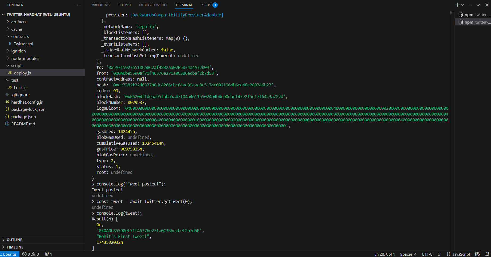

# Simple Twitter Smart Contract

This is a simple Solidity smart contract that works like Twitter, allowing users to post short tweets. Each tweet is stored on the blockchain with a unique ID, the user’s address.

## Features
- Users can post tweets (max 280 characters).
- Each tweet has a unique ID.
- Tweets are stored with the user's Ethereum address and a timestamp.
- Users can retrieve their tweets using their address.

## How It Works
- Post a Tweet: Users can call postTweet("Your tweet here") to store a tweet on the blockchain.
- Retrieve a Tweet: Use getTweet(tweetId) to fetch a specific tweet by ID.
- Get All Tweets by a User: Call getUserTweets(userAddress) to list all tweet IDs posted by a user.

## Output

  
